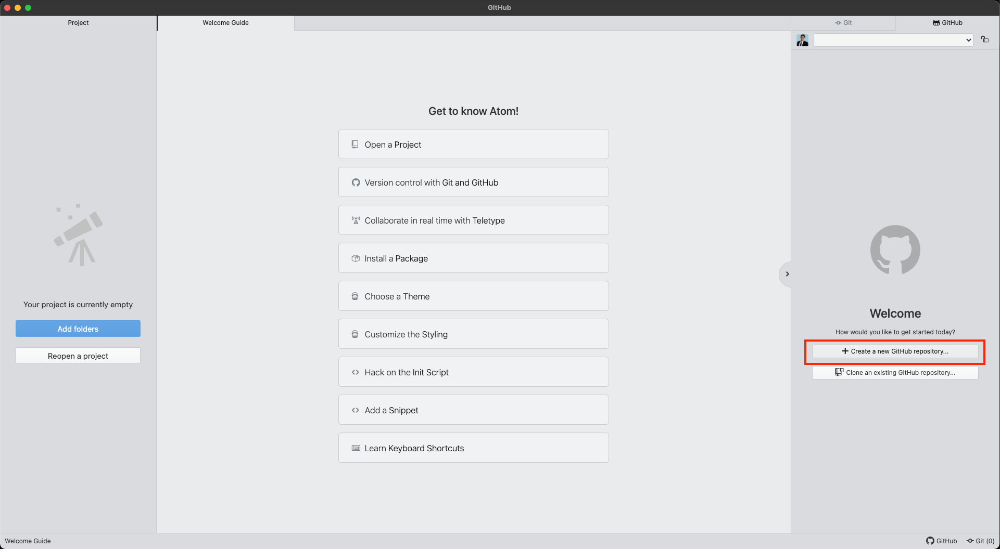

# Github

GitHub is a code hosting platform for version control and collaboration. It lets you and others work together on projects from anywhere.

## Installing Git on MacOS, Linux, and Windows

Prerequisites:
* [x] [Create Github Account](https://github.com/)

**Option 1: Install Git on MacOS Using Homebrew (https://brew.sh/)

:one: Copy and Paste the Command Above in your macOS Terminal by clicking on the clipboard

:two: Then type in "brew install git" in your macOS Terminal, and voilà, your done.

**Option 2: Install Git on Linux

:one: Determine which Linux distribution your system is based on, and then follow the directions above. 

**Option 3: Install Git on Windows (https://gitforwindows.org/)

:one: Download Git from the Website by clicking on the Download buttonn and following the prompts.

## Connecting GitHub with Atom

Prerequisites:
* [x] [Create Github Account](https://github.com/)
* [x] [Download and Install Atom](https://atom.io/)
* [x] [Using your Github Token to authenticate/connect Atom with Github](https://github.atom.io/login)

We found two easy ways:

**Option 1: Create a repository within Atom and pushing it to your Github repository.**

**Option 2: Create a repository within Github and cloning it into Atom.**

:one:	Create a Github repository

:two:	Copy either HTTPS or SSH link (HTTPS and SSH are two methods of authentication used to connect to a Git repo. HTTPS is the default. If you're interested in learning more about the difference. Check out [Should You Use HTTPS or SSH For Git](https://www.howtogeek.com/devops/should-you-use-https-or-ssh-for-git/) by Anthony Heddings.

:three:	Go to Atom and do Cmd + Shift + P or Ctrl + Shift + P. This opens the search bar. Type "Github Clone" and click on the result: Github Clone

:four:	Paste the link from step 2 into the clone from field and hit clone. You're all set! :grinning:

## Other Useful Resources:
- [7 min - Learn how to create a GitHub repo, clone, and commit with Atom](https://www.youtube.com/watch?v=6HsZMl-qV5k)

- [30 min - Routine use of git and github](https://kbroman.org/github_tutorial/pages/routine.html)

## :bust_in_silhouette: Authors
- Franklin Tan
- Dylan Juarez

## :hourglass: Last Updated
- 09/12/2022
